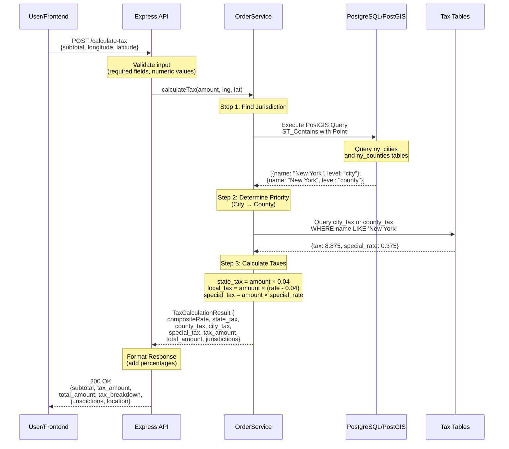
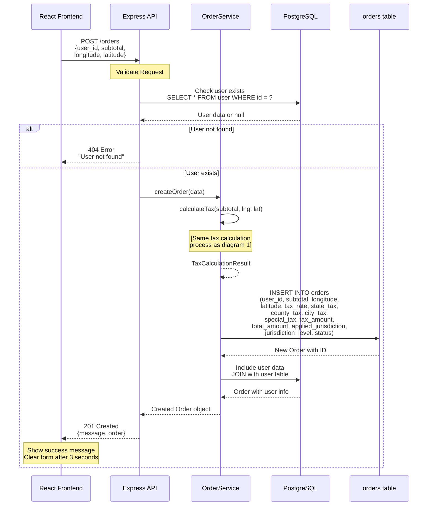
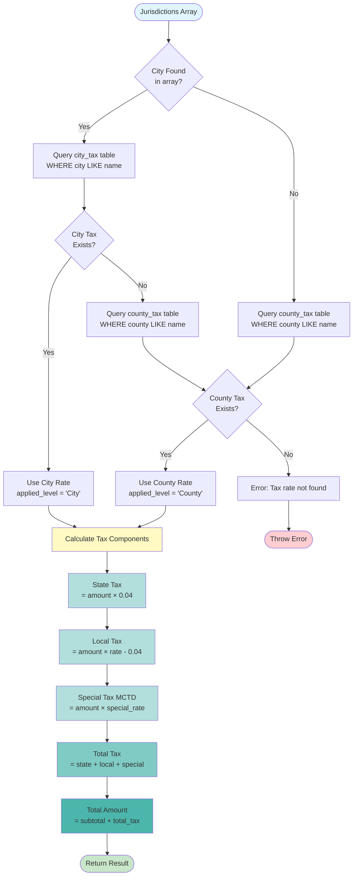
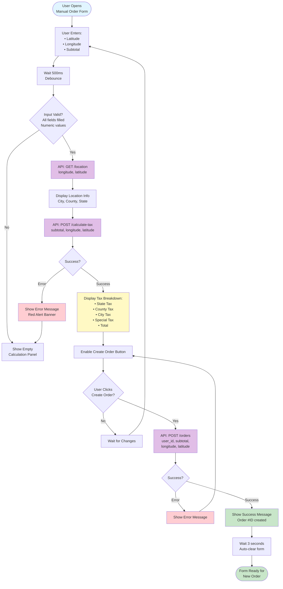
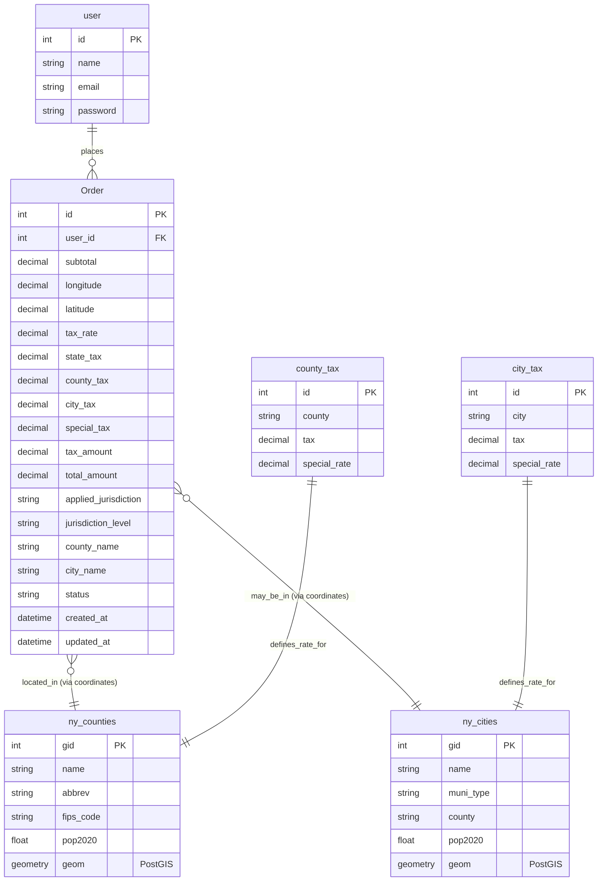
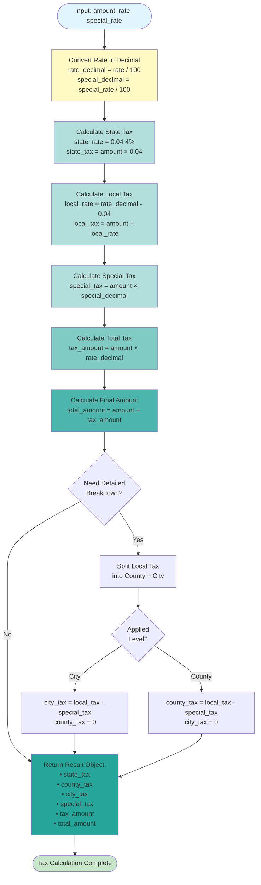

# Tax Calculation Flow Diagrams

## 1. Complete System Flow



## 2. Order Creation Flow



## 3. Geographic Lookup Process (PostGIS)

```mermaid
flowchart TD
    Start([Coordinates Received<br/>lat, lng]) --> CreatePoint[Create Point Geometry<br/>ST_Point lng, lat]
    
    CreatePoint --> SetSRID[Set Coordinate System<br/>ST_SetSRID point, 4326<br/>WGS84]
    
    SetSRID --> QueryCity{Query ny_cities<br/>ST_Contains geom, point}
    
    QueryCity -->|Found| CityResult[City: name, geometry]
    QueryCity -->|Not Found| NoCity[No City]
    
    CityResult --> QueryCounty
    NoCity --> QueryCounty{Query ny_counties<br/>ST_Contains geom, point}
    
    QueryCounty -->|Found| CountyResult[County: name, geometry]
    QueryCounty -->|Not Found| Error[Error: Outside NY State]
    
    CountyResult --> Combine[Combine Results]
    CityResult --> Combine
    
    Combine --> Return[Return Jurisdictions Array<br/>[{name, level: 'city'},<br/>{name, level: 'county'}]]
    
    Return --> End([Continue to Tax Lookup])
    Error --> EndError([Throw Error])
    
    style Start fill:#e1f5ff
    style End fill:#c8e6c9
    style EndError fill:#ffcdd2
    style CreatePoint fill:#fff9c4
    style SetSRID fill:#fff9c4
    style QueryCity fill:#ffe0b2
    style QueryCounty fill:#ffe0b2
```

## 4. Tax Rate Determination Logic



## 5. Frontend User Interaction Flow



## 6. Database Schema Relationships



## 7. Tax Calculation Detailed Algorithm



## Usage

Copy any of these Mermaid diagrams into:
- GitHub markdown (renders automatically)
- Mermaid Live Editor (https://mermaid.live/)
- Documentation tools that support Mermaid
- VS Code with Mermaid extension

## Diagram Descriptions

1. **Complete System Flow**: End-to-end sequence of API call and tax calculation
2. **Order Creation Flow**: Process of creating and storing an order
3. **Geographic Lookup**: PostGIS spatial query process
4. **Tax Rate Determination**: Decision tree for choosing tax rate
5. **Frontend Flow**: User interaction with the React component
6. **Database Schema**: Entity relationships and table structure
7. **Tax Calculation Algorithm**: Detailed step-by-step calculation logic
